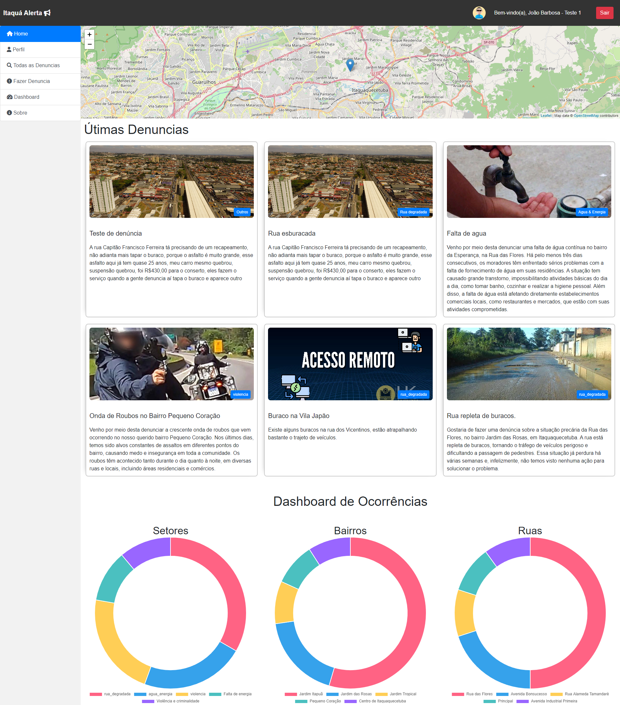

# Projeto de Denúncias - README

Este é um projeto de sistema de denúncias onde os usuários podem registrar incidentes, como poluição ambiental, roubos, entre outros, por meio de um formulário online. Além disso, o sistema envia um e-mail de confirmação para o usuário após o registro da denúncia.

## Funcionalidades

- **Registro de Denúncias:** Os usuários podem preencher um formulário com informações sobre a denúncia, incluindo título, categoria, bairro, rua, número, data da ocorrência, descrição e foto.
- **Envio de E-mail:** Após o registro da denúncia, um e-mail é enviado para o usuário com um resumo da denúncia, incluindo as informações fornecidas no formulário.
- **Verificação de Idade:** O sistema verifica a idade do usuário antes de permitir o registro da denúncia. Apenas usuários com idade superior a 16 anos podem registrar denúncias.
- **Validação de E-mail:** O sistema verifica se o e-mail do usuário é válido antes de enviar o e-mail de confirmação da denúncia.

## Tecnologias Utilizadas

- 
  
  Linguagem de programação para a lógica do sistema.
- 
  
  Banco de dados para armazenar as informações das denúncias e dos usuários.
- 
  
  Biblioteca para envio de e-mails.
- 
  
  Para a criação das páginas do sistema.
- 
  
  Para a criação das páginas do sistema.
- 
  
  Framework de CSS para estilização responsiva.
- 
  
  Para validações e interações na página.

## Configuração do Projeto

1. Clone o repositório para o diretório desejado em seu servidor web.
2. Crie um banco de dados no MySQL e importe o arquivo de estrutura do banco de dados (`database.sql`).
3. Configure as credenciais do banco de dados no arquivo `db_connect.php`.
4. Certifique-se de que a biblioteca PHPMailer esteja corretamente instalada e configurada. Certifique-se também de que os caminhos para os arquivos PHPMailer (Exception.php, PHPMailer.php e SMTP.php) estejam corretos.
5. No arquivo `enviar_denuncia.php`, configure as credenciais do servidor de e-mail no objeto `$mail`.
6. Execute o projeto em seu navegador e teste o registro de denúncias.

## Como Usar

1. Acesse a página inicial do sistema.
2. Clique no botão de "Registrar Denúncia".
3. Preencha o formulário com as informações da denúncia.
4. Envie o formulário. Se tudo estiver correto, a denúncia será registrada e um e-mail de confirmação será enviado para o usuário.
5. Verifique a caixa de entrada do e-mail fornecido para visualizar o e-mail de confirmação.

## Observações

- Certifique-se de ter as extensões PHP necessárias habilitadas em seu servidor.
- Pode ser necessário configurar permissões de escrita para a pasta de uploads das fotos, para permitir o upload de imagens.

## Print de Exemplo

## Créditos

Este projeto foi desenvolvido por [João Barbosa](https://joaosbarbosa.com.br/) como parte de um projeto de estudo ou profissional. Consulte a licença do projeto para obter mais informações sobre o uso e distribuição deste código.

